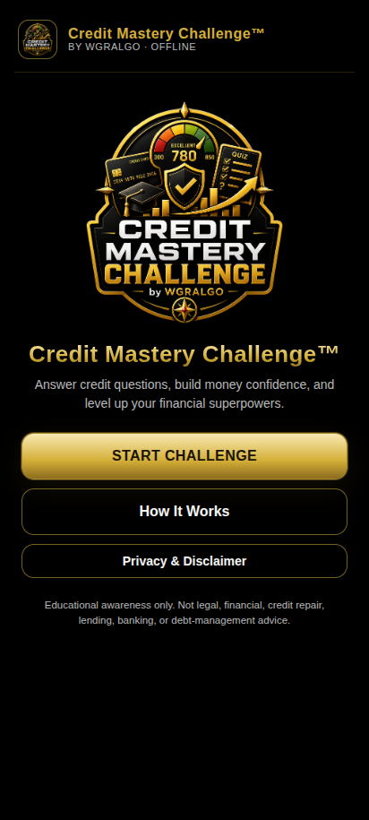
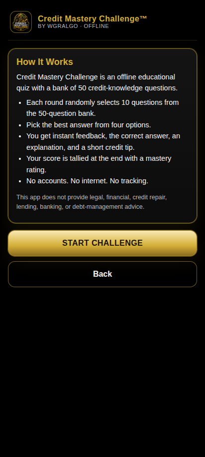
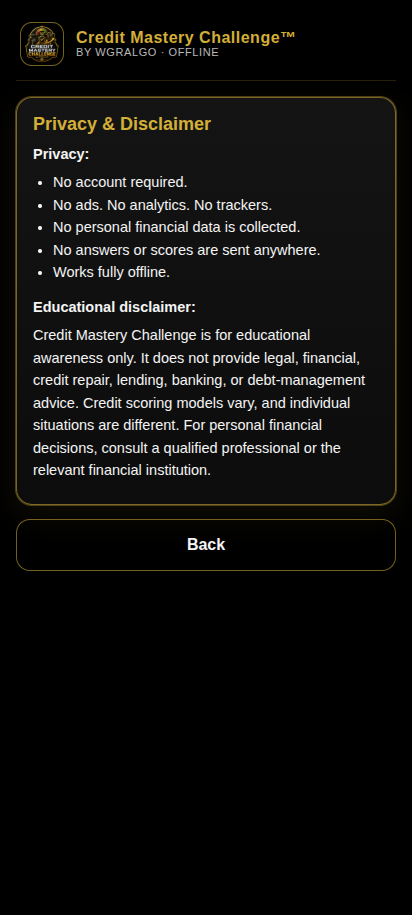
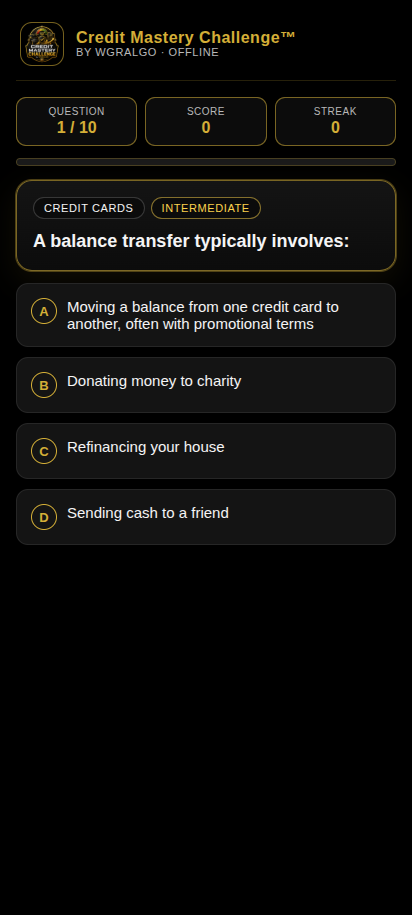
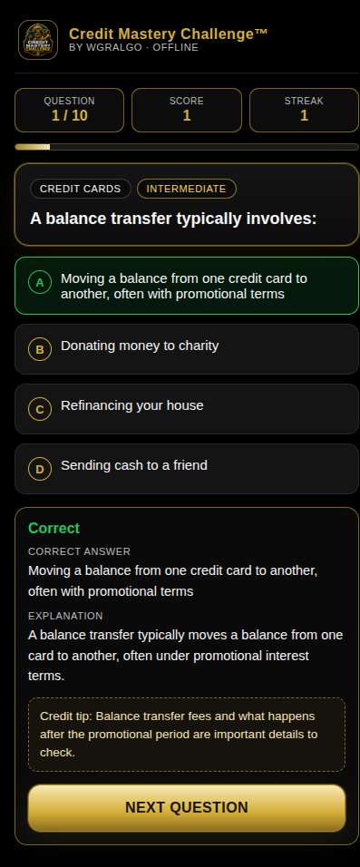
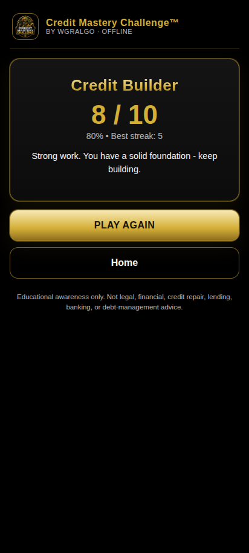

# WGRALGO Credit Mastery Challenge

Credit Mastery Challenge is a free educational Android app from
**The Wealth Gap Resolution Algorithm&trade; Inc.** It helps users practice
credit knowledge through a randomized 50-question quiz covering credit scores,
credit reports, payment history, utilization, inquiries, fraud protection, and
responsible borrowing.

The app is offline-first, free, ad-free, and tracker-free.

- Version: **1.0.0**
- Package: `org.wgralgo.creditmasterychallenge`
- License: **GNU General Public License v3.0**
- Owner / Publisher: WGRALGO &mdash; The Wealth Gap Resolution Algorithm&trade; Inc.
- Concept page: https://thewealthgapresolutionalgorithm.org/credit-mastery-challenge/

## Features

- 50-question offline credit-knowledge bank
- 10 randomized questions per round
- Difficulty badges (Beginner / Intermediate / Advanced)
- Category badges (Credit Scores, Payment History, Utilization, Inquiries,
  Reports, Cards, Interest Rates, Minimum Payments, Collections, Late
  Payments, Debt-to-Income, Building Credit, Credit Myths, Fraud Protection,
  Responsible Borrowing)
- Instant correct / incorrect feedback
- Plain-language explanations for every question
- Short credit education tips on every question
- Score, streak, and final mastery rating
  - 90&ndash;100%: Credit Master
  - 75&ndash;89%: Credit Builder
  - 60&ndash;74%: Money Student
  - Below 60%: Needs More Practice
- Tablet and phone responsive
- Black and gold WGRALGO design language

## Screenshots

| Home | How It Works | Privacy |
|---|---|---|
|  |  |  |

| Question | Feedback | Results |
|---|---|---|
|  |  |  |

## Install / sideload the APK

1. Download `CreditMasteryChallenge-v1.0.0.apk` from the
   [latest release](../../releases/latest).
2. On your Android phone, allow installs from unknown sources for your
   browser or file manager.
3. Open the APK file on the device and confirm install.
4. Optionally verify the SHA-256 of the APK matches
   `CreditMasteryChallenge-v1.0.0.apk.sha256` before installing.

## Build from source

This is a Capacitor 6 app with a vanilla HTML / CSS / JS frontend in `www/`.

```bash
# Web assets are pre-built; just sync into the Android project
npm install
npx cap sync android

# Then build the Android APK
cd android
./gradlew assembleRelease
# Output: android/app/build/outputs/apk/release/app-release.apk
```

### Release signing

Release builds expect a `android/keystore.properties` file (NEVER committed)
or environment variables:

```
CMC_KEYSTORE_FILE=/absolute/path/to/your-release.jks
CMC_KEYSTORE_PASSWORD=...
CMC_KEY_ALIAS=...
CMC_KEY_PASSWORD=...
```

Or a `keystore.properties` file in `android/` with the same keys.

## Privacy summary

- No account required
- No ads, no analytics, no trackers
- No data selling, no cloud upload
- No personal financial data is collected
- No answers or scores are sent to WGRALGO or anywhere else
- The APK does NOT declare the `INTERNET` permission

See [PRIVACY.md](PRIVACY.md) for details.

## Educational disclaimer

Credit Mastery Challenge is for **educational awareness only**. It does not
provide legal, financial, credit repair, lending, banking, or debt-management
advice. Credit scoring models vary, and individual situations are different.
For personal financial decisions, consult a qualified professional or the
relevant financial institution.

## License

This project is released under the **GNU General Public License v3.0**.
See [LICENSE](LICENSE) for the full license text.

## Contributors

See [CONTRIBUTORS.md](CONTRIBUTORS.md).
