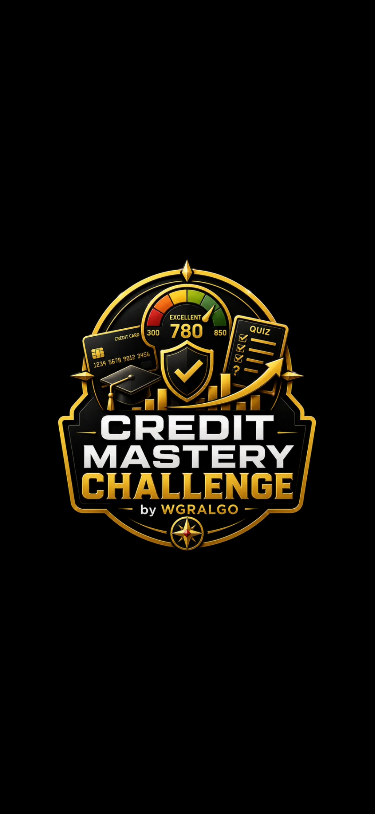
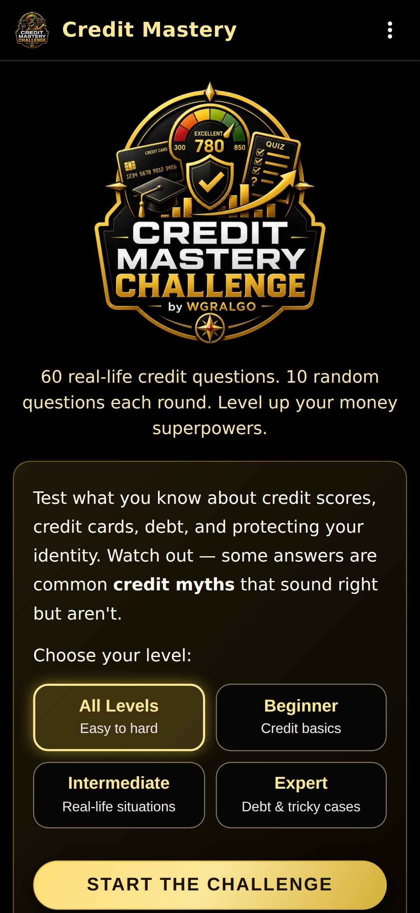
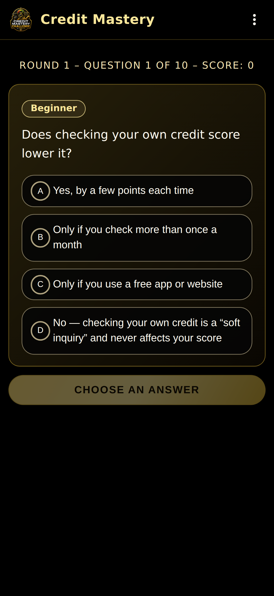
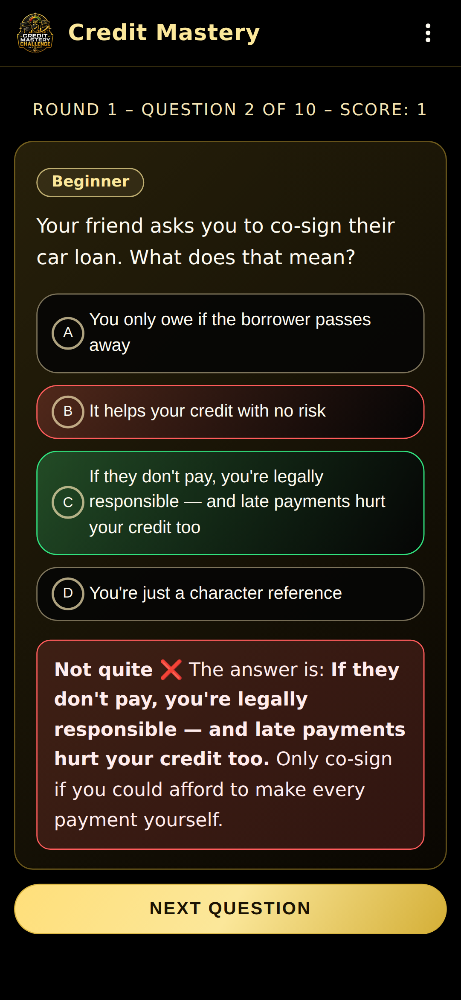
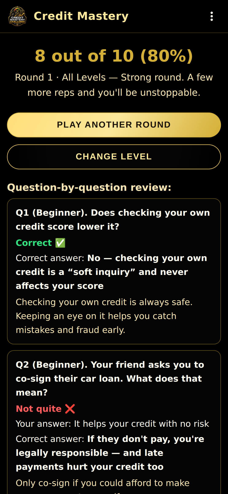
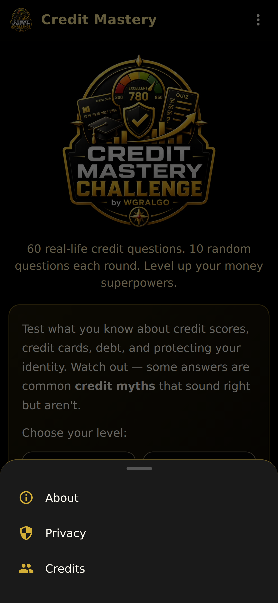
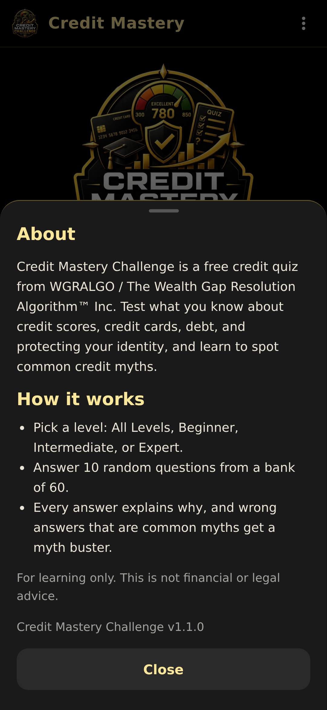

# WGRALGO Credit Mastery Challenge

Credit Mastery Challenge is a free educational Android app from
**The Wealth Gap Resolution Algorithm&trade; Inc.** Test what you know about
credit scores, credit cards, debt, and protecting your identity, and learn to
spot the common **credit myths** that sound right but aren't.

The app is offline-first, free, ad-free, and tracker-free.

- Version: **2.0.0**
- Devices: phones and tablets, portrait and landscape
- Package: `org.wgralgo.creditmasterychallenge`
- License: **GNU General Public License v3.0**
- Owner / Publisher: WGRALGO &mdash; The Wealth Gap Resolution Algorithm&trade; Inc.
- Concept page: https://thewealthgapresolutionalgorithm.org/credit-mastery-challenge/

## Features

- **60-question bank**, 20 per level: **Beginner** (credit basics),
  **Intermediate** (real-life situations), and **Expert** (debt and tricky cases).
- Pick **All Levels** (easy to hard) or one level. 10 random questions per round,
  with no repeats until the bank runs out.
- Answer order is shuffled every time, so any letter can be correct.
- Instant feedback with a plain-language lesson after every answer.
- **Myth busters:** pick a common credit myth and the app explains why it's wrong.
- Results with your score, a question-by-question review, and a running total
  across rounds.
- **Looks like a real app:** black launch screen with the big logo, a new
  launcher icon, a solid app bar, About / Privacy / Credits panels, and
  Android back-button support (back asks before quitting a round, returns to
  the level picker from results, and asks before exiting the app).

## Screenshots

| Launch | Home | Question | Feedback |
|---|---|---|---|
|  |  |  |  |

| Results | Menu | About |
|---|---|---|
|  |  |  |

## Install / sideload the APK

1. Download `WGRALGO-CreditMasteryChallenge-v2.0.0.apk` from the
   [latest release](../../releases/latest).
2. On your Android phone, allow installs from unknown sources for your
   browser or file manager.
3. Open the APK file on the device and confirm install.
4. Optionally verify the SHA-256 of the APK matches
   `WGRALGO-CreditMasteryChallenge-v2.0.0.apk.sha256` before installing.

> **Upgrading from v1.0.0?** Version 1.1.0 is signed with a new key, so it
> can't install over the old app. Uninstall v1.0.0 first, then install v1.1.0.
> The app saves nothing on your device, so nothing is lost.

### Signing certificate (v1.1.0 and later)

- `CN=WGRALGO, OU=Credit Mastery Challenge, O=The Wealth Gap Resolution Algorithm Inc, C=US`
- SHA-256: `24:33:F7:9D:C2:F7:23:3D:56:29:A4:9D:E6:92:70:5B:ED:F7:69:46:D9:6C:96:45:E9:71:9C:B1:E6:C9:6F:CF`

```bash
apksigner verify --print-certs WGRALGO-CreditMasteryChallenge-v2.0.0.apk
```

## Build from source

This is a Capacitor 6 app with a vanilla HTML / CSS / JS frontend in `www/`.

```bash
# Web assets are pre-built; just sync into the Android project
npm install
npx cap sync android

# Then build the Android APK
cd android
./gradlew assembleRelease
# Output: android/app/build/outputs/apk/release/app-release.apk
```

### Release signing

Release builds expect a `android/keystore.properties` file (NEVER committed)
or environment variables:

```
CMC_KEYSTORE_FILE=/absolute/path/to/your-release.jks
CMC_KEYSTORE_PASSWORD=...
CMC_KEY_ALIAS=...
CMC_KEY_PASSWORD=...
```

Or a `keystore.properties` file in `android/` with the same keys.

Check a build before publishing:

```bash
bash tools/validate-release.sh android/app/build/outputs/apk/release/app-release.apk
```

## Continuous integration and releases

- [`.github/workflows/android.yml`](.github/workflows/android.yml) builds a
  debug APK on every push and pull request.
- [`.github/workflows/release.yml`](.github/workflows/release.yml) builds,
  validates, signs, and publishes `CreditMasteryChallenge-v<version>.apk` with
  its `.sha256` to GitHub Releases. Run it from the **Actions** tab or push a
  `v*` tag. It needs these repository secrets: `CMC_KEYSTORE_BASE64`,
  `CMC_KEYSTORE_PASSWORD`, `CMC_KEY_ALIAS`, `CMC_KEY_PASSWORD`.

## Privacy summary

- No account required
- No ads, no analytics, no trackers
- No data selling, no cloud upload
- No personal financial data is collected
- No answers or scores are sent to WGRALGO or anywhere else
- The APK does NOT declare the `INTERNET` permission

See [PRIVACY.md](PRIVACY.md) for details.

## Educational disclaimer

Credit Mastery Challenge is for **educational awareness only**. It does not
provide legal, financial, credit repair, lending, banking, or debt-management
advice. Credit scoring models vary, and individual situations are different.
For personal financial decisions, consult a qualified professional or the
relevant financial institution.

## License

This project is released under the **GNU General Public License v3.0**.
See [LICENSE](LICENSE) for the full license text.

## Contributors

See [CONTRIBUTORS.md](CONTRIBUTORS.md).
